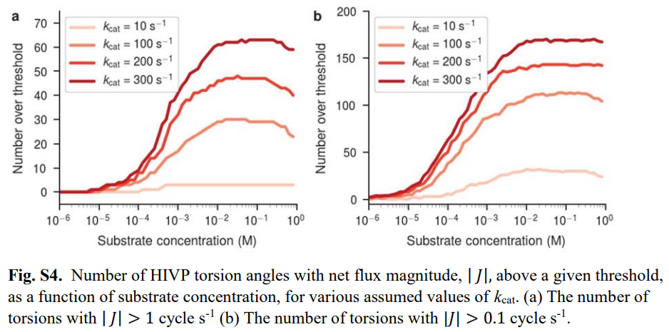
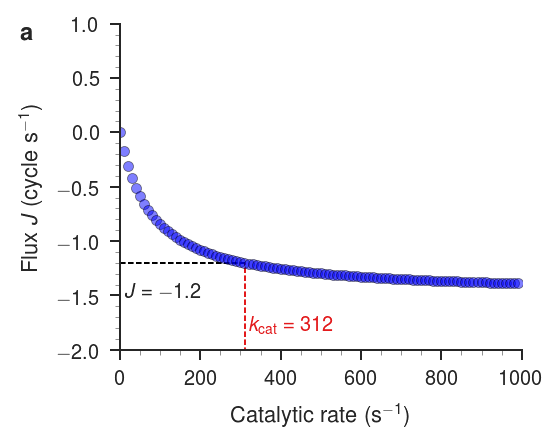

We thank the reviewers for their considered responses of our manuscript "Motor-Like Properties of Non-Motor Enzymes".
We believe the reviewers have highlighted some important issues with the phrasing of our conclusions.
However, we also believe some of the reviewers' comments can be addressed quickly and succinctly.
One of the main concerns raised is that our conclusions are not well supported due to a lack of controls.
We have extensively looked at the robustness of our results in terms of variations in assumptions and parameters, but we neglected to include all of these in our manuscript, due to concerns over space.
Below, we've included several additional pieces of evidence that support our conclusions and address the reviewers' concerns.

## Reviewer 1

### Major criticisms

> First, using the same model, the authors should explain carefully how the enzymes without significant conformational change exhibit enhanced diffusivity upon catalysis?

We would like to clarify that the primary goal of our manuscript is not to explain the enhanced diffusivity of enzymes upon catalysis.
Rather, we focus on revealing and describing the dynamics of chiral molecules -- such as enzymes -- that are driven out of equilibrium by a concentration gradient of substrate and product.
Strictly speaking, our results are not specific for enzymes and a conformational change is not required.
Any chiral molecule that can be placed out of equilibrium has the potential to undergo directional motion along one degree of freedom.
The extent to which a molecule shows net flux depends on the shape of the two potential energy surfaces for each state.
The model we employ was developed using theoretical reasoning about the motion of Brownian particles [@doi:10.1126/science.276.5314.917], but the emergence of directional flux in biological systems has hitherto remained unexplored.
Our conclusions state that the "the hydrodynamic coupling [...] might help explain why some enzymes diffuse faster when catalytically active."
We will modify the text of our conclusion to highlight that the behavior we describe is just one possible mechanism for enhanced diffusivity.

> Likewise, for the enzymes with significant conformational changes that have very low kcat, what will the model predict?

In the main text, we describe this case using HIV protease (HIVP) which has a catalytic rate an order of magnitude lower than the rates for adenylate kinase (ADK) and protein kinase A (PKA).
We demonstrate that artificially boosting the catalytic rate of HIVP to be comparable to that of ADK and PKA, increases the number of torsions that show directional flux and the magnitude of the flux.
This comparison is explicitly shown in Figures 1b, 1c, 1d, and 1f where curves for HIVP with both low and high catalytic rates are shown.
Figure S4 goes into more detail on the effect of $k_\text{cat}$ by depicting the number of torsions that show directional flux above a particular threshold as a function of both concentration and intermediate catalytic rates (reproduced below).

{#fig:figure-s4 width=20cm}

Increasing the catalytic rate increases the number of torsions that have directional flux above a threshold, but this effect saturates at large values for the catalytic rate.
The saturating effect is shown in one of the `jupyter` notebooks linked in the [GitHub](https://github.com/GilsonLabUCSD/nonequilibrium/) site listed in the acknowledgments.
For the $\chi$ 2 dihedral angle in Thr175 of ADK, flux as a function of catalytic rate from $k_\text{cat} = 0 \,\text{s}^{-1}$ to $k_\text{cat} = 1000 \,\text{s}^{-1}$ is shown.

{#fig:flux-vs-catalytic-rate width=10cm}

We will include this plot in the manuscript and discuss the role of catalytic rate more systematically.

> Finally, the authors should carefully explain the role of change in torsional landscape and kcat (specifically in some simplistic models and fluctuating landscapes) in producing directed motion and then show the link of either landscape and kcat for the motor proteins, thus showing the evolutionary link.

This is an incisive comment, correctly noting that the shape of the potential energy surface and $k_\text{cat}$ are the two dominant factors affecting the level of directional flux observed.
We have looked at simplistic models for the potential energy surfaces, such as flat, monotonically increasing, and sawtooth landscapes.

We have looked at the effect of symmetrizing landscapes as "controls."
This is also shown in the [GitHub](https://github.com/GilsonLabUCSD/nonequilibrium/) site listed in the acknowledgments.

### Minor criticisms

> The choice of force-field and simulation time can alter the sampled states of torsional angles? It needs to be explored and explained in detail that there is no bias due to force-field or simulation length.

This is a good point
The choice of force field will have an effect.
However, since our goal was to highlight htis motion
The torsional population histograms converge rapidly during simulation time.
[Figure]

> The choice of bin size (why was it chosen as 60 per conformation?) Does different bin size alter the results?

Bin size was chosen arbitrarily, but the bin size and number of bins does not alter the results.
[Figure]

> The choice of D is not clear, what happens in different D values?
Finally, transition in adjacent states, I think detailed balance should be taken into account.

$D$ was chosen to replicate free diffusion in the absence of any energy barriers.
That is, $D$ controls how rapidly the landscape is sampled.
We calculated this using the diffusion of butane in free ... (as described in the SI).
Further, the choice of $D$ is saturating.

## Reviewer 2

### Major criticisms

> Why did they choose this model? In what way is it better than more straightforward free energy and rate calculations used in atomistic simulations?

Separate simulations of apo and bound state protiens

> The procedure for determining the chemical potential and rate coefficients seems a bit convoluted and not as straightforward as it can be.

We mixed experimental data
