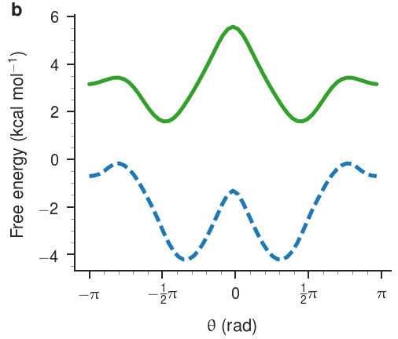
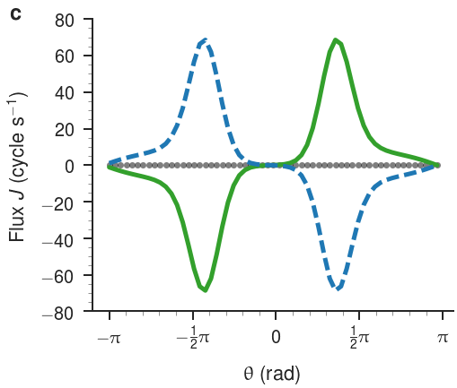
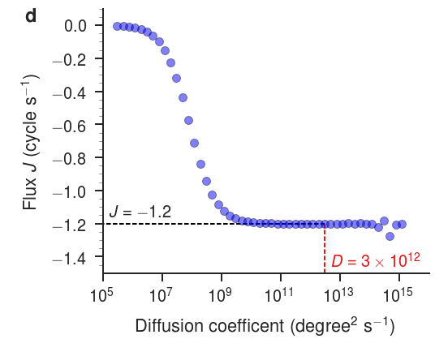

---
author-meta:
- David R. Slochower
date-meta: '2017-08-17'
keywords:
- work-in-progress
- markdown
- manuscript
- publishing
title: Response to reviewers for "Motor-Like Properties of Non-Motor Enzymes" by Slochower
  and Gilson, PNAS 2017-11059
...

We thank the reviewers for their considered responses of our manuscript "Motor-Like Properties of Non-Motor Enzymes".
We believe the reviewers have highlighted some important issues with the phrasing of our conclusions.
However, we also believe some of the reviewers' comments can be addressed quickly and succinctly.
One of the main concerns raised is that our conclusions are not well supported due to a lack of controls.
We have extensively looked at the robustness of our results in terms of variations in assumptions and parameters, but we neglected to include all of these in our manuscript, due to concerns over space.
Below, we've included several additional pieces of evidence that support our conclusions and address the reviewers' concerns.

## Reviewer 1

### Major criticisms

> First, using the same model, the authors should explain carefully how the enzymes without significant conformational change exhibit enhanced diffusivity upon catalysis?

We would like to clarify that the primary goal of our manuscript is not to explain the enhanced diffusivity of enzymes upon catalysis.
Rather, we focus on revealing and describing the dynamics of chiral molecules -- such as enzymes -- that are driven out of equilibrium by a concentration gradient of substrate and product.
Strictly speaking, our results are not specific for enzymes and a conformational change is not required.
Any chiral molecule that can be placed out of equilibrium has the potential to undergo directional motion along one degree of freedom.
The extent to which a molecule shows net flux depends on the shape of the two potential energy surfaces for each state.
The model we employ was developed using theoretical reasoning about the motion of Brownian particles [@miCoCNAy], but the emergence of directional flux in biological systems has hitherto remained unexplored.
Our conclusions state that the "the hydrodynamic coupling [...] might help explain why some enzymes diffuse faster when catalytically active."
We will modify the text of our conclusion to highlight that the behavior we describe is just one possible mechanism for enhanced diffusivity.

> Likewise, for the enzymes with significant conformational changes that have very low kcat, what will the model predict?

In the main text, we describe this case using HIV protease (HIVP) which has a catalytic rate an order of magnitude lower than the rates for adenylate kinase (ADK) and protein kinase A (PKA).
We demonstrate that artificially boosting the catalytic rate of HIVP to be comparable to that of ADK and PKA, increases the number of torsions that show directional flux and the magnitude of the flux.
This comparison is explicitly shown in Figures 1b, 1c, 1d, and 1f where curves for HIVP with both low and high catalytic rates are shown.
Figure S4 goes into more detail on the effect of $k_\text{cat}$ by depicting the number of torsions that show directional flux above a particular threshold as a function of both concentration and intermediate catalytic rates (reproduced below).

{#fig:figure-s4 width=20cm}

Increasing the catalytic rate increases the number of torsions that have directional flux above a threshold, but this effect saturates at large values for the catalytic rate.
The [GitHub](https://github.com/GilsonLabUCSD/nonequilibrium/) site listed in the acknowledgments contains a [`jupyter` notebook](https://github.com/GilsonLabUCSD/nonequilibrium/blob/418bd87da31165c8a0e5105b005bb24bfc06fe39/supplementary-information.ipynb) that shows the saturating effect undering the heading "How does changing the catalytic rate change the flux results?".
For the $\chi_2$ dihedral angle in Thr175 of ADK, flux as a function of catalytic rate from $k_\text{cat} = 0 \,\text{s}^{-1}$ to $k_\text{cat} = 1000 \,\text{s}^{-1}$ is shown.

{#fig:flux-vs-catalytic-rate width=10cm}

We will include this plot in the manuscript and discuss the role of catalytic rate more systematically.

> Finally, the authors should carefully explain the role of change in torsional landscape and kcat (specifically in some simplistic models and fluctuating landscapes) in producing directed motion and then show the link of either landscape and kcat for the motor proteins, thus showing the evolutionary link.

This is an incisive comment, correctly noting that the shape of the potential energy surface and $k_\text{cat}$ are the two dominant factors affecting the level of directional flux observed.
I believe we addressed the role of $k_\text{cat}$ above.
We have looked at simplistic models for the potential energy surfaces, such as flat, monotonically increasing, and sawtooth landscapes.
Any surface that is symmetric (i.e., an even function) will not produce directional flux because clockwise and counterclockwise motion are equally likely.
As "controls," we symmetrized the landscapes by averaging each population histogram with its reflection about $0$ rad.
Symmetrized surfaces have high levels of directional flux along each surface -- what we term "reciprocating flux" in the manuscript -- but sum to zero.
This is shown in another [`jupyter` notebook](https://github.com/GilsonLabUCSD/nonequilibrium/blob/418bd87da31165c8a0e5105b005bb24bfc06fe39/supplementary-information-symmetry.ipynb) listed on the [GitHub](https://github.com/GilsonLabUCSD/nonequilibrium/) in the acknowledgments, for the $\chi_2$ dihedral angle in Thr175 of ADK.

{width=10cm} {width=10cm}

We believe the asymmetric potential energy surfaces are a result of evolutionary pressures, leading to chiral building blocks for proteins, but we cannot prove this hypothesis.
As mentioned earlier, we omitted these results from the supplementary information because we did not have space to discuss the figures in the main text, but we are happy to include them in a revision.
We can also add instructive examples showing results for simplistic landscapes.

### Minor criticisms

> The choice of force-field and simulation time can alter the sampled states of torsional angles? It needs to be explored and explained in detail that there is no bias due to force-field or simulation length.

This is a good point; the choice of force field will have an effect on the population histograms and thus, the potential energy surfaces.
We can repeat our simulations using other force fields.
However, we intend these results to stand on their own as an example of directed, motor-like behavior, and we do not expect the choice of force field to affect the subjective description of the motion.
A spot check revealed the torsional population histograms converge rapidly during simulation time.
We can properly quantify this and show a summary of the convergence.

> The choice of bin size (why was it chosen as 60 per conformation?) Does different bin size alter the results?

Bin size was chosen arbitrarily, but the bin size and number of bins does not alter the results.
We have performed the analysis on fewer bins and interpolating to larger number of bins.
We can mention these results in the manuscript.

> The choice of D is not clear, what happens in different D values?

We discuss the choice of $D$ under the heading "Assignment of numerical parameters."
We write "An initial estimate of $D$ was made by averaging the angular diffusion of the central C-C-C-C torsion in butane over a hundred, 1 ns Langevin dynamics simulations, with the force field torsion and nonbonded terms set to zero (i.e., with no barrier to rotation)."
We then go on to say that the results are not sensitive to $D$ above $\sim 10^9$ degree$^{2}$ s$^{-1}$.
Similar to how we showed the flux as a function of catalytic rate for the $\chi_2$ dihedral angle in Thr175 of ADK, this [`jupyter` notebook](https://github.com/GilsonLabUCSD/nonequilibrium/blob/418bd87da31165c8a0e5105b005bb24bfc06fe39/supplementary-information-symmetry.ipynb) shows the flux as a function of diffusion coefficient.

{#fig:flux-vs-d width=10cm}

> Finally, transition in adjacent states, I think detailed balance should be taken into account.

In equilibrium -- where the catalytic rate is set to zero -- there is detailed balance between adjacent bins.
However, once the system is out of equilibrium, detailed balance is no longer satisfied.

## Reviewer 2

### Major criticisms

> Why did they choose this model? In what way is it better than more straightforward free energy and rate calculations used in atomistic simulations?

Our model does not require a separate free energy calculation for each dihedral angle for each amino acid in each system, which I think is the proposed alternative by the reviewer.
Rather, we can use the equilibrium distributions to determine the potential energy surfaces dihedral.
This requires only two simulations: one simulation for each system state instead of thousands of simulations to determine the free energy profiles using a technique such as umbrella sampling.

> The procedure for determining the chemical potential and rate coefficients seems a bit convoluted and not as straightforward as it can be.

We agree that the methods section could be clarified.
It is true the method may be complicated, but we do not know of an alternative, more straightforward way to determine the chemical potentials, and we believe our formulation is appropriate and correct.
The chemical potentials are derived from the concentrations of the protein, substrate, and product for each system in a standard way.
The chemical potentials are then offset so the apo and bound state are populated in accordance with the dissociation coefficient.
That is, the we use an energy offset that ensures the apo and bound states are equally populated when the concentration of substrate is equal to the experimentally-determined $K_\text{d}$.

## References
